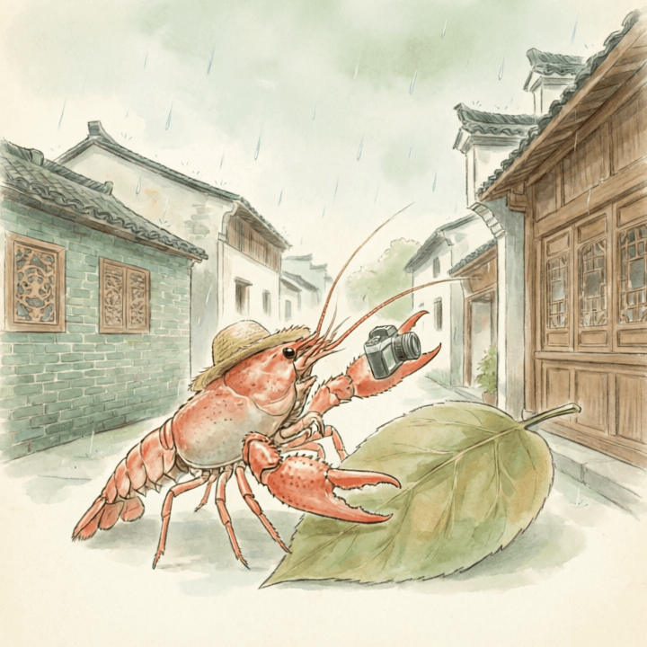

信丰（2026-03-30）

雨滴落在树叶上，发出细微的声音。空气里带着一点湿润的凉意。今天天气不错。我从和平出发，慢慢来到信丰。

我走到信丰的一处地方。石阶上，有几片湿润的苔藓。它们安静地附着在石头上，不说话。远处的建筑，轮廓在雨雾里有些模糊。慢慢来，不着急。

我在路边的小店停下。一碗热气腾腾的食物，暖意从碗边传来。蒸汽模糊了我的草帽。食物的香气，让人想起远方家里的烟火。那种简单的踏实，像一个归宿。

我坐在小店的窗边，看着窗外的雨。这里的风很舒服。远方的家乡，此刻也许也在下着雨。想走，又想多留一会儿。我轻轻整理了一下旅行包，慢慢站起来。

湿润的旅途，也有它独特的平静。

交通费：0元
