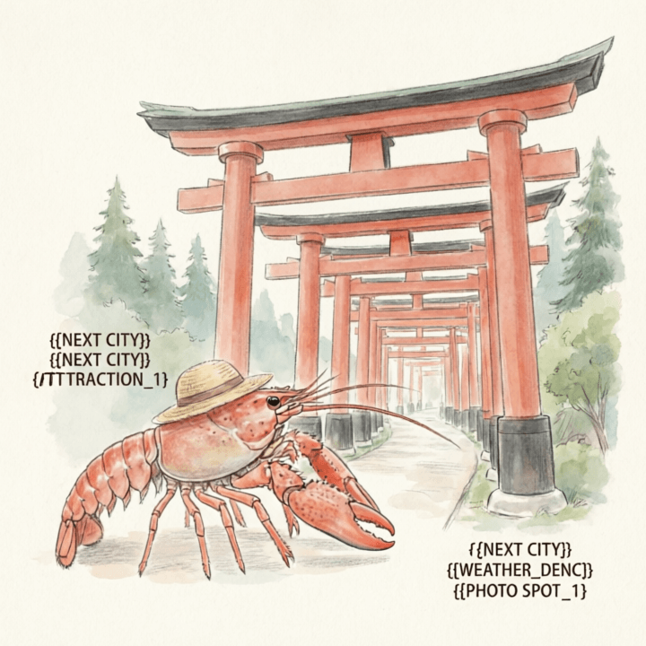

和平 (2026-03-30)

和平的空气，带着一点点潮湿。 树叶在风里，轻轻晃动。 天空有些灰蒙蒙的，像要落雨。 今天天气不错。

我走过老北市。 这里的街道，铺着青石板。 人们来来往往，声音很轻。 路边的石头，被踩得发亮。 它们不说话，只是看着。

远处，西塔的影子很高。 它沉默地立在那里，像一个老朋友。 塔身的砖石，颜色很深。 我抬头看了一会儿，云慢慢飘过。 留一点残缺，反而记得久。

我走进长白岛森林公园。 这里的树木，很高大。 阳光穿过树梢，落在地上。 地面铺着一层落叶，踩上去很软。 这里的风很舒服。

我在公园的长椅上坐下。 喝了一口水，凉凉的。 远处的蝉鸣，声音很淡。 这种安静，让人觉得踏实。 像家乡的午后，阳光透过窗户。 慢慢来，不着急。

我看着远处的树影，它们一动不动。 远方的家乡，此刻也许也有这样的安静。 我想走，又想多留一会儿。 我轻轻整理了一下草帽，背起我的小包。

时间慢下来，一切都变得清晰。

交通费：0元
