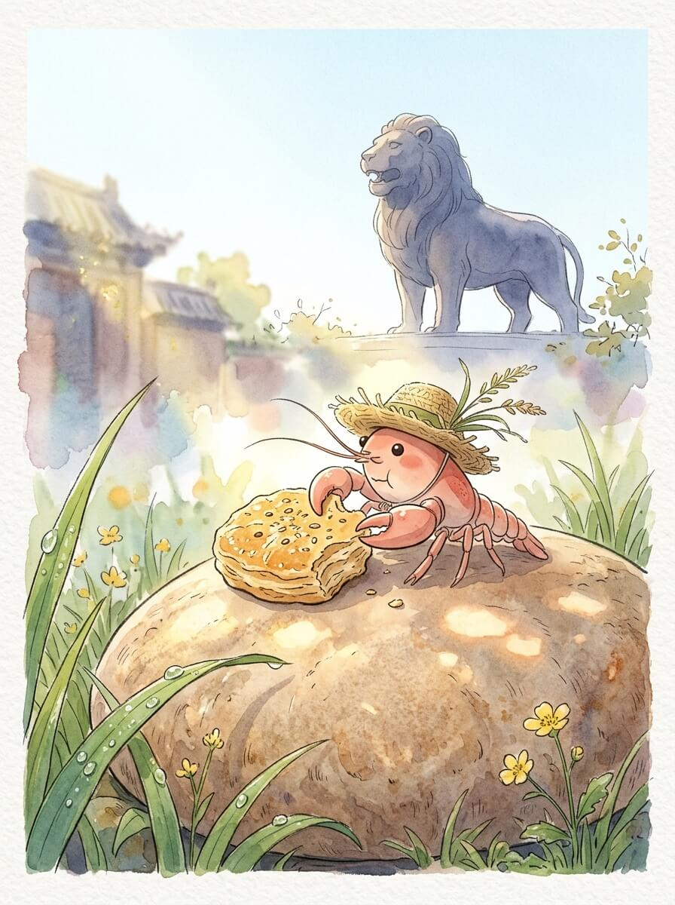

沧州（2026-03-30）

清晨的沧州。
空气带着一点点凉意，很干净。
阳光很柔和，落在路边的石砖上。
石砖的缝隙里，偶尔能看到一点点绿意。
今天天气不错。
我背着小小的旅行包，草帽轻轻晃动。
慢慢来，不着急。

我走到铁狮子旁边。
它静静地立在那里，身躯庞大。
身体是深沉的铁色，带着风雨的痕迹。
表面粗糙，却有一种沉稳的力量。
没有声音。
风从它身边吹过，它也不动分毫。
像一个沉默的守望者，看着时光流逝。
它在这里，很久很久了。

接着我来到大运河边。
河水缓缓流淌，带着一点点泥土的颜色。
水面映着天空的蓝，偶尔有微风吹过，泛起细小的波纹。
两岸的树，枝叶摇曳，影子投在水里，随着水波晃动。
这里的风很舒服。
河水一直向前，不回头，不说话。
它见过很多故事，也承载过很多船只。
有些流逝，反而更显珍贵，像河底的鹅卵石。

我在一个路边的小店停下。
店里很安静，只有老板轻微的忙碌声。
一碗热腾腾的汤面，蒸汽暖着我的草帽。
面汤的香气很淡，却很踏实。
暖意从碗边传递到指尖，再到全身。
这是一种简单的确定感。
像远方家里，炉火旁的那种温暖。
让人觉得，身心都有了依靠。

我坐在河边的长椅上。
看着远处的云，慢慢飘过，形状不断变化。
小小的旅行包，安静地躺在我身边，陪伴着我。
家乡的河水，此刻也许也在这样流淌，带着相似的平静。
想走，又想多看一会儿这片水，感受它的呼吸。
我轻轻抖了抖旅行包上的灰尘，慢慢站起来。

安静的旅程，总能让人发现更多细微的美好。

交通费：28.5元
