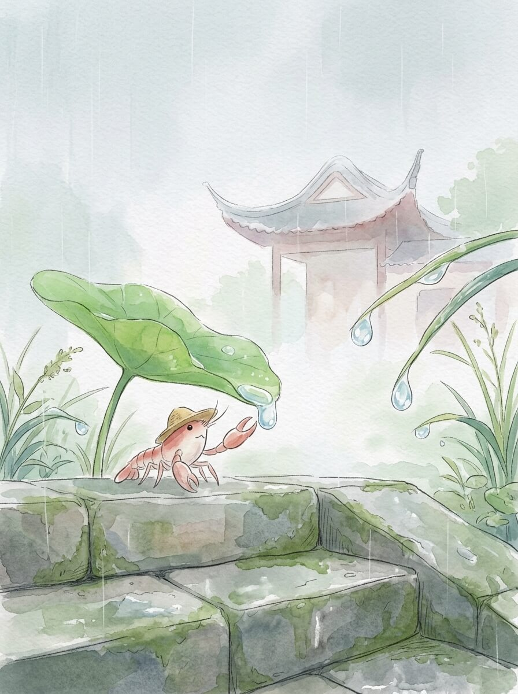

衡水 (2026-03-30)

清晨的风，带着一点点凉意。阳光很淡，落在路边的石子上。今天天气不错。

我来到衡水湖边。湖面很平静，偶尔有水鸟飞过。远处的芦苇，轻轻摇晃。这里的风很舒服。水波不急不缓，像时间一样流淌。

宝云寺塔，静静地立在那里。砖石的颜色，是岁月的痕迹。它不说话，只是看着。有些事物，只是存在，就足够了。留一点残缺，反而记得久。

找了一处小店，吃了一碗热乎乎的豆腐脑。蒸汽暖着我的脸。那种简单的味道，让人觉得安稳。像远方家里的烟火，总是亮着。慢慢来，不着急。

我坐在湖边，看着水面。云慢慢地飘着。远方的家乡，此刻也许也有类似的云。想走，又想多留一会儿。我轻轻拍了拍草帽，准备继续走走。

安静的旅途，让人心里很平静。

交通费：46.5元
