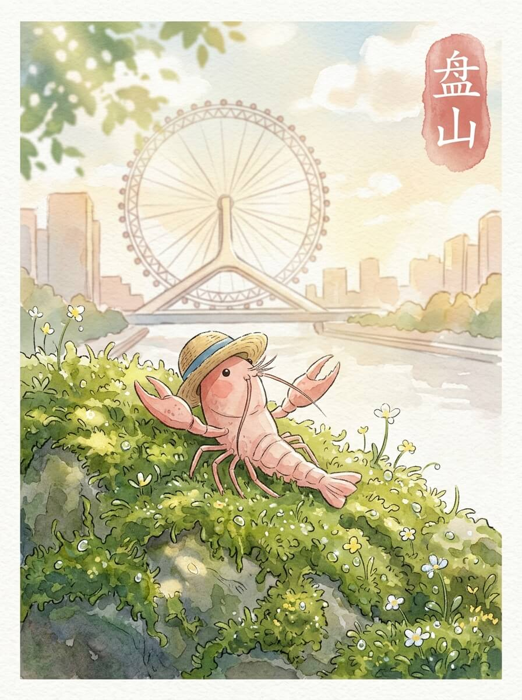

今日坐标：天津（2026-03-31）

清晨的光线，透过薄薄的云层，落在路边的石砖上。
一点点暖意，慢慢散开，驱散了夜的凉意。
我的淡红色身体，在阳光下显得更柔和了一些。
小小的草帽，被微风轻轻吹动，带来一丝清爽。
今天天气不错。

我走到海河边。
巨大的天津之眼，在水面上方静静地转动着。
它的轮廓，像一个沉默的观察者。
每一个透明的座舱，都承载着不同的风景和故事。
它不说话，只是看着这座城市慢慢醒来，看着河水缓缓流淌。
高处的风，也许会更舒服一些，带着远方的味道。

我沿着五大道的老街慢慢走着。
那些旧时的洋楼建筑，排列整齐，带着岁月的沉淀。
红砖墙壁上的藤蔓，爬满了绿意，也爬满了时光留下的痕迹。
它们像沉默的守卫，静静地站立着，记录着每一个经过的行人。
旧物有旧物的语言，不急着说清，只待有心人去感受。
这里的风很舒服，带着泥土和老树的味道。

接着，我去了古文化街。
青石板路，被无数脚步磨得光滑，蜿蜒向前。
两旁的店铺里，摆放着一些精致的小物件。
泥人张的塑像，栩栩如生，杨柳青的画，色彩淡雅。
它们不喧哗，只是静静地在那里，等待着有缘人的驻足。
我好奇地看了一会儿，没有急着离开。

我在一个街角停下，找了个安静的地方。
一碗热腾腾的豆腐脑，冒着白气，暖意扑面而来。
咸香的味道，在口中慢慢散开，让人感到一种踏实。
那种物理上的温暖，就像远方家里的烟火，总是那么确定和安心。
慢慢来，不着急。

我坐在河边的长椅上，看着云慢慢飘过，看着河水慢慢流淌。
远方的家乡，此刻也许也有相似的云朵，相似的河流。
想走，去看看更远的地方，又想多留一会儿，享受这份宁静。
我轻轻拉了拉旅行包的肩带，感受着它的重量，然后慢慢站起来。

慢下来的时间，让一切都变得清晰。

交通费：18.5元
