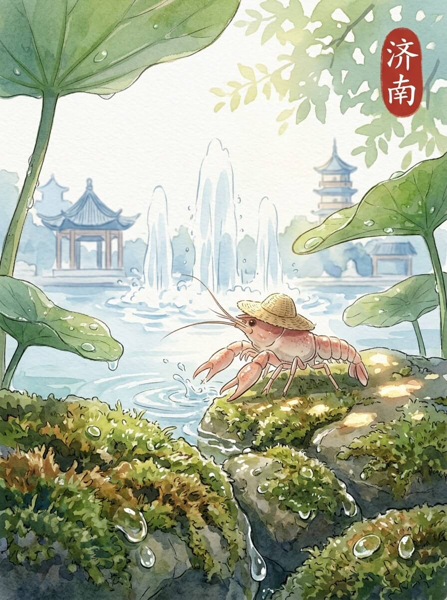

济南（2026-04-02）

阳光落在我的草帽边沿。 今天的风，带着一点点暖意。 我抖了抖旅行包，慢慢走着。 济南的早晨，很安静。 今天天气不错。

泉水从地下涌出，带着细小的气泡。 它们不说话，只是向上冒着。 水面泛着微光，倒映着天上的云。 这里的风很舒服。 留一点残缺，反而记得久。

湖水很宽阔，一眼望不到边。 几只水鸟，在水面上轻轻划过。 湖边的柳树，枝条垂得很低。 它们看着湖水，也看着远方。

我在路边的小店坐下。 一杯热茶，暖着我的指尖。 茶香淡淡的，让人觉得很踏实。 这种温暖，像家乡的炉火。 慢慢来，不着急。

我坐在湖边的石头上。 看着水面，时间也慢了下来。 远方的家乡，此刻也许也有这样平静的水面。 我轻轻摸了摸旅行包，它陪我走了很远。 想走，又想多留一会儿。 我站起来，继续往前走了一点点。

慢下来的时间，让一切都变得清晰。

交通费：333元
