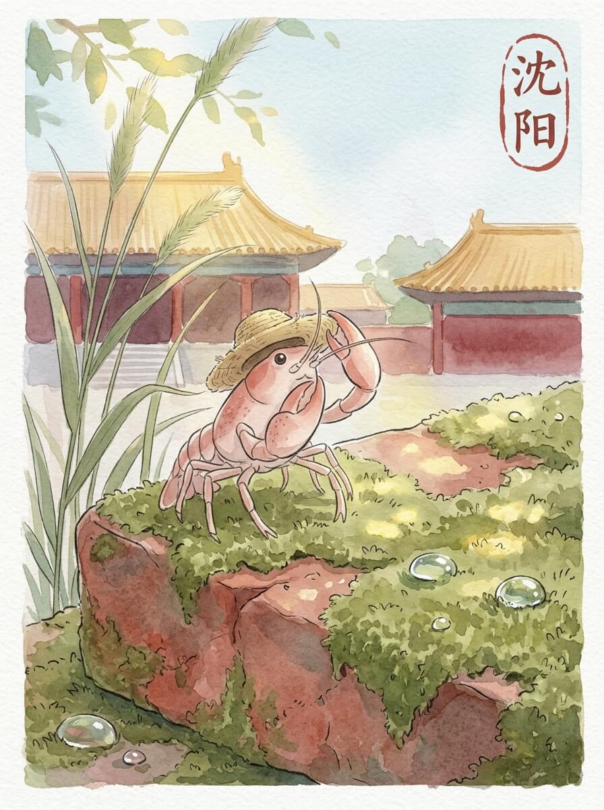

沈阳 (2026-04-07)

清晨的风，带着一点点凉意。 吹过窗台，也吹过我的草帽。 慢慢来，不着急。 今天天气不错。

红色的宫墙，在阳光下显得有些旧了。 砖缝里，有几株小草探出头。 它们不说话，只是静静地生长着。 这里的风很舒服。

高大的松柏，围着一座陵墓。 树影落在石碑上，像一幅沉默的画。 历史的痕迹，一点点刻在上面。 留一点残缺，反而记得久。

我找了一处安静的茶馆。 一杯热茶，暖着我的小螯。 茶香淡淡的，让人想起家里的味道。 那种踏实的感觉，像远方的一盏灯。 慢慢来，不着急。

我坐在窗边，看着街上的人流。 他们各自忙碌着，像水中的小鱼。 远方的家乡，此刻也许也有类似的喧闹。 想走，又想多留一会儿。 我轻轻整理了一下旅行包，准备动身。

慢下来的时间，让一切都变得清晰。

交通费：317元
