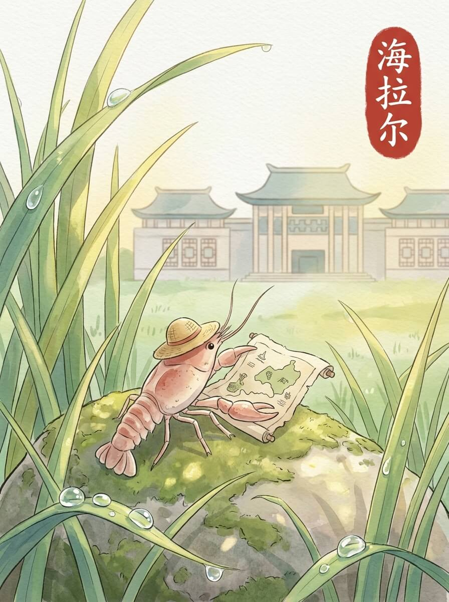

海拉尔（2026-04-11）

清晨的阳光，带着一点点凉意，落在窗玻璃上。
今天的风，吹得很轻。
今天天气不错。

我到了呼伦贝尔民族博物馆。
建筑的墙面是灰色的，安静地立在那里。
玻璃窗反射着天空的颜色。
里面有些沉默的展品，不说话。
它们只是在那里，被时间轻轻抚摸。

后来去了成吉思汗广场。
广场很大，风从远处吹来。
雕塑高高地立着，看着远方。
它们只是在那里，不言不语。
有些故事，不需要声音，也能被记住。

我在路边的小店，吃了一碗热乎乎的羊肉汤。
汤的蒸汽，暖着我的脸。
碗里的肉片，带着一点点香气。
这种温暖，像远方家里炉火的温度。
慢慢来，不着急。

我坐在公园的长椅上，看着天空。
云朵慢慢地飘着，像家乡小河里的水草。
这里的风很舒服。
远方的家，此刻也许也有这样安静的云。
我轻轻动了动我的草帽，继续看着远方。

风吹过的痕迹，让心底有了回响。

交通费：70元
