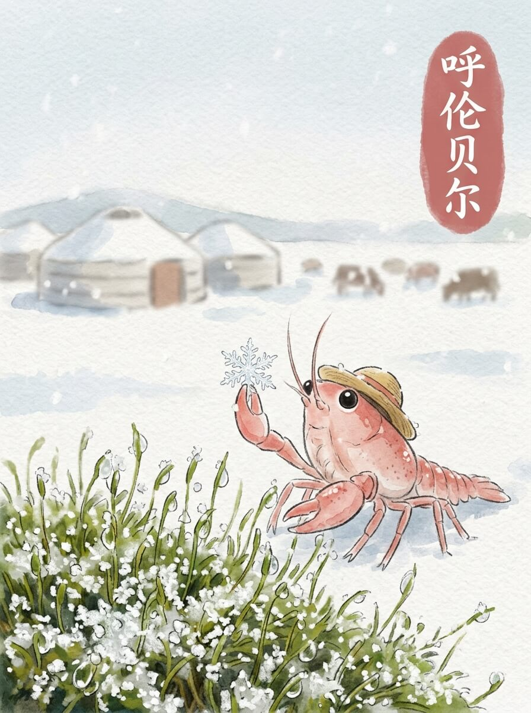

呼伦贝尔（2026-04-12）

小小的雪花，在风里打着转。
它们落在我的草帽上，很快就化成一点点水珠。
空气很冷，带着一点点湿润。
今天天气不错。
慢慢来，不着急。

我站在一片白色的世界里。
呼伦贝尔大草原，此刻被雪覆盖着。
远处的草，被雪压得低低的。
它们沉默着，像在等待什么。
风吹过，雪粒在地面上滑动。
这里的风很舒服，带着远方的味道。

后来，我看到了一些彩色的影子。
满洲里套娃广场，那些套娃安静地立在那里。
它们有不同的颜色，不同的图案。
大的套娃，小的套娃，一个套着一个。
它们不说话，只是看着天空。
留一点残缺，反而记得久。

找了一个小小的角落。
一杯热腾腾的奶茶，暖着我的手。
蒸汽升起来，模糊了窗外的雪景。
奶茶的甜味，让人想起家里炉火的温度。
那种踏实的温暖，像远方的一盏灯。
慢慢来，不着急。

我看着窗外，雪还在轻轻地下着。
远方的家乡，此刻也许没有雪。
想走，又想多留一会儿。
我轻轻抖了抖旅行包上的雪花，慢慢站起来。

雪落无声，心底却有了清晰的印记。

交通费：1元
