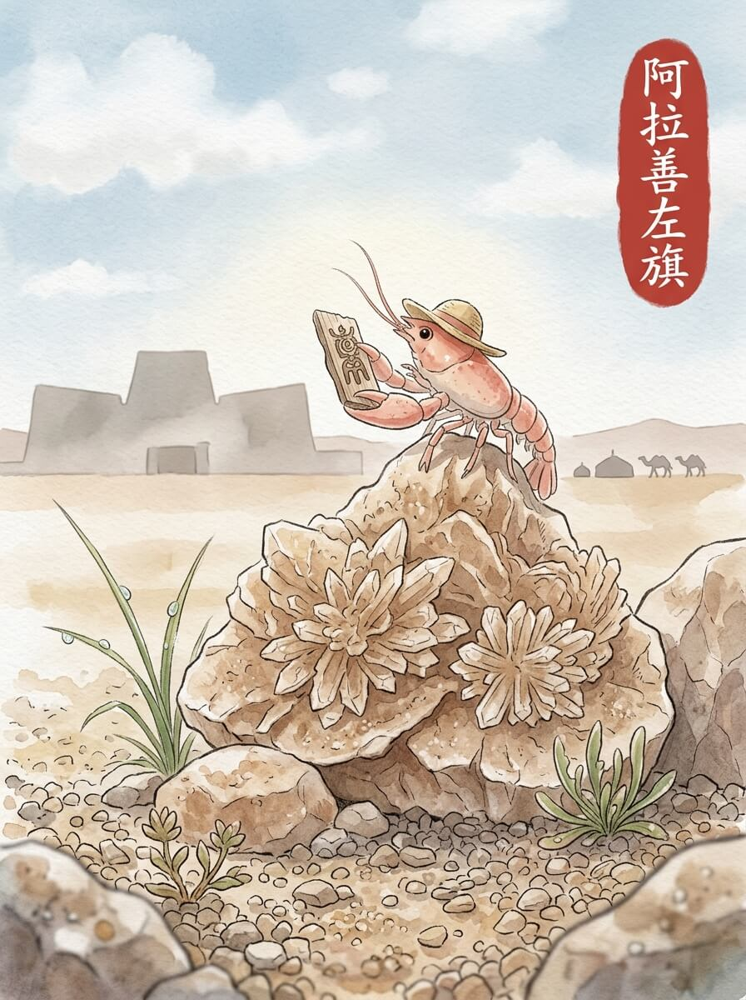

阿拉善左旗（2026-04-13）

今天天气不错。
阿拉善左旗的天空，云朵半掩着阳光。
风带着一点点沙土的气息，轻轻拂过我的草帽。
地面的石子，被风磨得有些圆润。
慢慢来，不着急。

我走进阿拉善博物馆。
展柜里，一些古老的物件安静地躺着。
它们沉默地讲述着时间的故事。
墙壁上的光影，随着云层移动。
留一点残缺，反而记得久。

王爷府的院落，砖瓦有些旧了。
风穿过门廊，发出细微的声响。
这里的风很舒服。
一棵老树，枝叶稀疏。
它静静地看着天空。

我在路边的小店，要了一碗热茶。
茶水的暖意，从杯子传到指尖。
这种温暖，像远方家里炉火的温度。
它带来一种踏实的感觉。
让人觉得，此刻就是归宿。

我坐在窗边，看着外面的人影。
云朵依然慢慢地飘着。
远方的家乡，也许此刻也有类似的云影。
想走，又想多留一会儿。
我轻轻理了理旅行包的带子，慢慢站起来。

风声渐远，心底却有了新的方向。

交通费：488.5元
