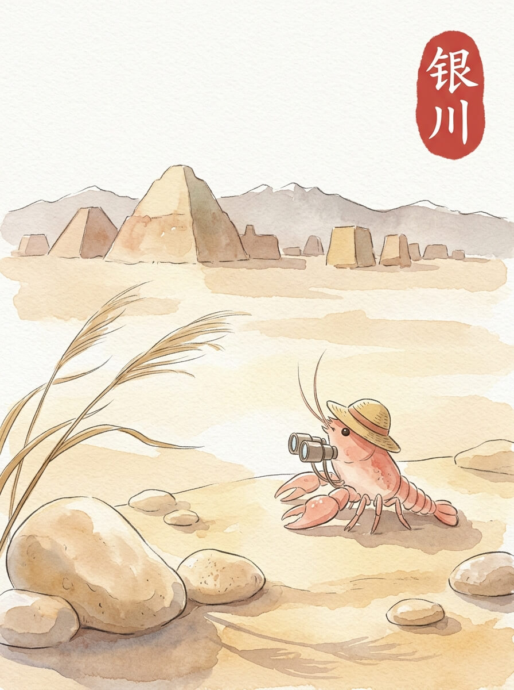

银川 (2026-04-14)

银川的清晨。
阳光落在我的草帽边沿。
风吹过，带来一点点沙土的气息。
今天天气不错。

我到了西夏王陵。
远处的陵墓，像一座座土堆。
它们安静地立在那里，看着天空。
风从土堆间穿过，发出低沉的声音。
这些沉默的建筑，似乎在讲述着什么。

我又去了沙湖。
湖水边，沙丘的线条很柔和。
水面偶尔有波纹，映着云的影子。
这里的风很舒服。
沙与水相遇，各自保留着自己的样子。

我在路边的小店，吃了一碗羊肉泡馍。
热气腾腾的，暖着我的身体。
汤的味道，让人觉得很踏实。
像家乡的池塘，虽然没有羊肉，但也有那种安稳的感觉。
慢慢来，不着急。

我走过镇北堡西部影城那些旧的城墙。
它们被风沙磨砺，露出斑驳的痕迹。
没有太多人，只有风声。
远方的家乡，此刻也许也有类似的旧墙。
我想走，又想多看一会儿。
我轻轻地，把旅行包放了下来。

风沙的低语，让心境有了归属。

交通费：19元
