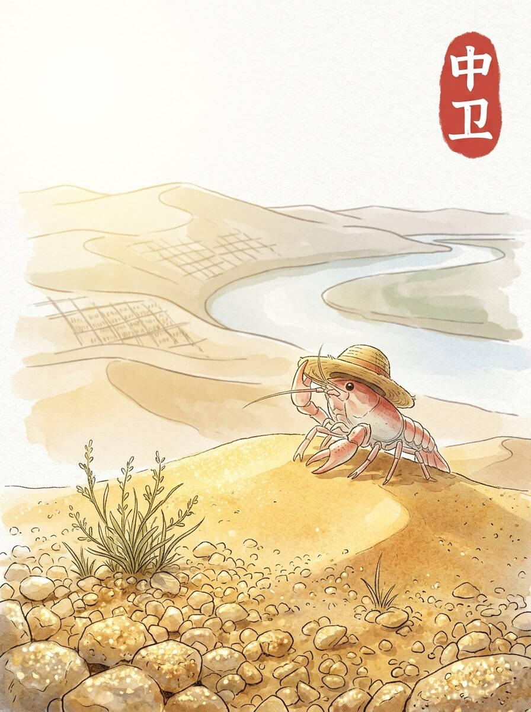

中卫（2026-04-16）

清晨的光线，落在沙粒上。 它们闪着微弱的光。 一点点风，吹过。 今天天气不错。

我到了沙坡头。 沙丘连绵，没有尽头。 脚下的沙子，细软。 远处的骆驼，慢慢走着。 它们不说话。

后来，我去了高庙保安寺。 寺庙的墙壁，有些斑驳。 檐角的风铃，偶尔发出轻响。 这里的空气，带着一点点香火的味道。 历史的痕迹，就这样留着。

我在路边的小店，吃了一碗面。 面条的热气，暖着我的脸。 汤的味道，简单又踏实。 就像家乡的厨房，总有熟悉的味道。 慢慢来，不着急。

我坐在金沙岛的湖边。 水面平静，映着天空。 这里的风很舒服。 远方的家乡，也许也有这样平静的水面。 我轻轻摸了摸草帽的边缘，又看了一眼远方。 想多看一会儿。

眼前的平静，让心底有了温柔的停靠。

交通费：41元
