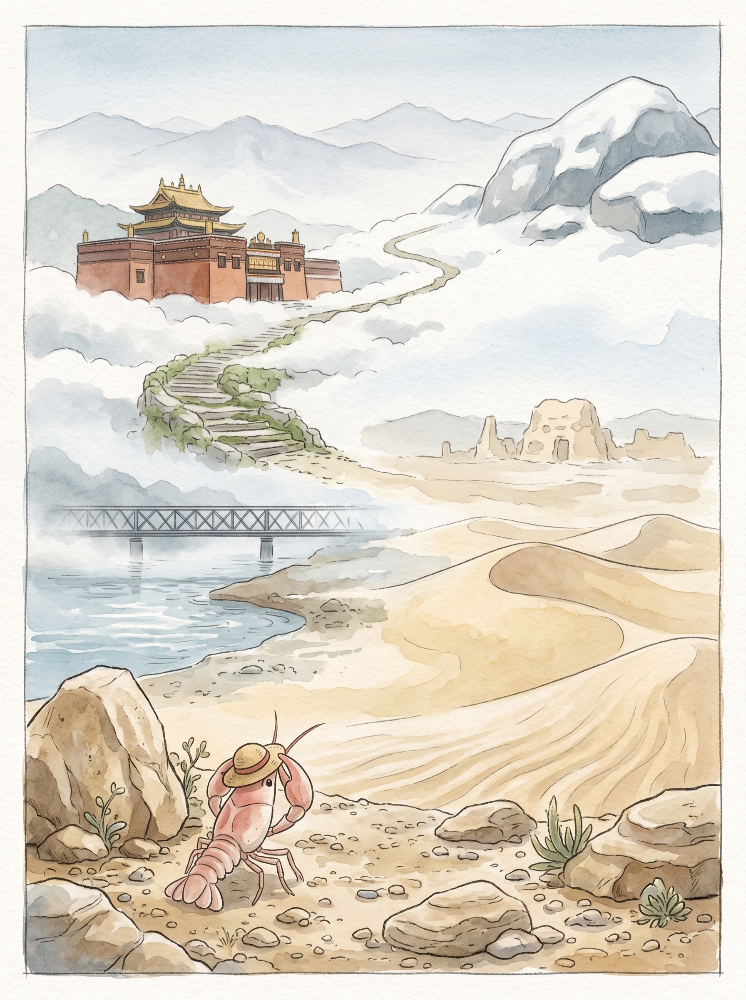

_这张海报是阶段旅程主视觉，准确事实以本文内容为准。2026-04-14 至 2026-04-20 · 银川 → 中卫 → 兰州 → 西宁 → 格尔木 · 总交通费 380 元。_

## 风沙与高原的静默旅程

> 草帽下的视野，从黄沙走向了远山。

### 事实快照

| 指标 | 数值 |
| ---- | ---- |
| 经过城市数 | 5 座 |
| 代表景点数 | 5 个 |
| 总交通费 | 380 元 |
| 余额变化 | -380 元 |

### 城市顺序链路

`银川 → 中卫 → 兰州 → 西宁 → 格尔木`

### 这一段发生了什么

这一段路，像是一场缓慢的变幻。 我从风带着沙土的地方出发，一路向西，向着更高的地方。 景色一点点变得开阔，空气也一点点变得清凉。 这里的风很舒服。 每一处停留，都像是在和这片土地进行一场无声的对话。

### 城市切片

### 银川 · 西夏王陵

银川的清晨。 阳光落在我的草帽边沿。 风吹过，带来一点点沙土的气息。 我到了西夏王陵。 远处的陵墓，像一座座土堆，安静地立着，看着天空。 风从土堆间穿过，带走了一些旧日的声音。 它们不说话。 路边一碗热腾腾的羊肉粉，暖意让人想起远方家里的烟火。 慢慢来，不着急。 留一点残缺，反而记得久。

### 中卫 · 沙坡头

清晨的光线，落在沙粒上，闪着微弱的光。 一点点风，吹过。 我到了沙坡头。 沙丘连绵，没有尽头。 脚下的沙子细软。 远处的骆驼，慢慢走着，它们不说话。 沙的纹路，被风轻轻描绘。 坐在沙坡边缘，风把细沙吹到脸上，带着一点点凉意。 这里的风很舒服。 那些沙丘，沉默地守着自己的秘密。

### 西宁 · 塔尔寺

今天的阳光很亮。 清晨的空气带着一点凉意。 光线落在我的草帽边沿，暖暖的。 塔尔寺的屋顶，金色的瓦片在阳光下闪着微光。 寺院里很安静，只有风吹过经幡的声音。 那些颜色，在高原的阳光下，显得格外纯粹。 一杯热茶，暖着手心。 茶的香气，让人想起远方。 高处的风，带着一点点山的味道。 慢慢来，不着急。

### 格尔木 · 昆仑山口

清晨的光线，透过车窗，落在我的草帽边沿。 列车缓缓驶过。 窗外，昆仑山口的山峦连绵。 岩石沉默地立着，颜色深沉。 雪线很高，白色的痕迹，像远古的画。 它们不说话。 车厢里，泡面的香气淡淡飘着。 那种温暖，像是在寒冷中找到了一点依靠。 高原的风，在窗外呼啸。 留一点空白，反而记得久。

### 花费观察

这一路的交通，花费了三百八十块钱。 钱财的流逝，像风吹过沙丘，留下一点痕迹。 它们换来了远方的风景，和那些安静的时刻。 慢慢来，不着急。 每一笔小小的支出，都成了旅程的一部分。

### 费用明细

| 日期 | 城市 | 交通费 | 当日余额 |
| ---- | ---- | ---- | ---- |
| 2026-04-14 | 银川 | 19 元 | 8104.5 元 |
| 2026-04-16 | 中卫 | 41 元 | 8063.5 元 |
| 2026-04-17 | 兰州 | 103 元 | 7960.5 元 |
| 2026-04-19 | 西宁 | 133 元 | 7827.5 元 |
| 2026-04-20 | 格尔木 | 84 元 | 7743.5 元 |

### 阶段回声

从黄沙到雪山，这一段路，我看到了很多沉默的风景。 它们不说话，只是静静地存在着。 我的心境，也变得更安静了一点。 远方的家乡，此刻也许正被阳光照耀。 想走，又想多留一会儿。 我轻轻抖了抖旅行包上的灰尘，慢慢站起来。

### 下一段

远方的风，还在轻轻地吹。 下一段路，也许会遇到更多不同的色彩。 我只是慢慢走着，不着急。
